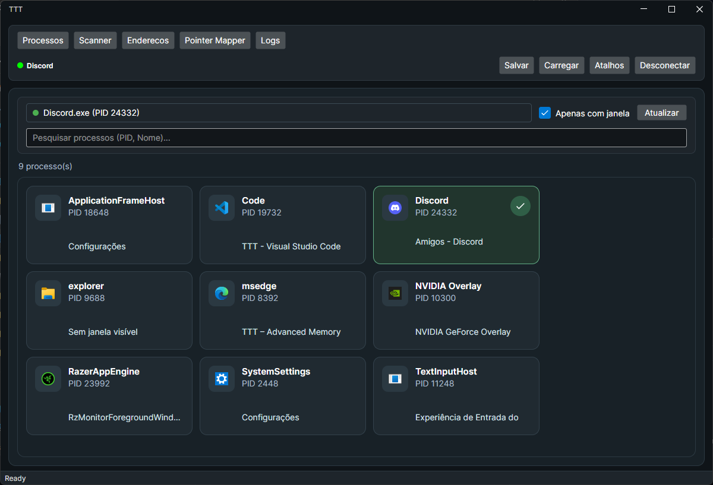
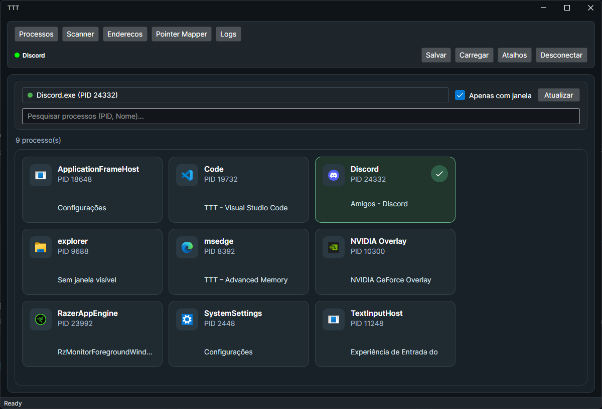
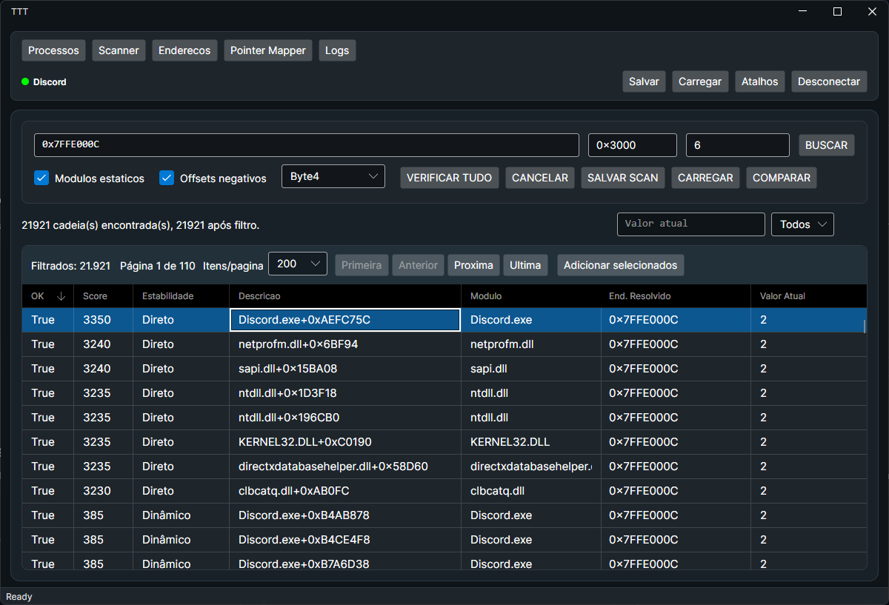
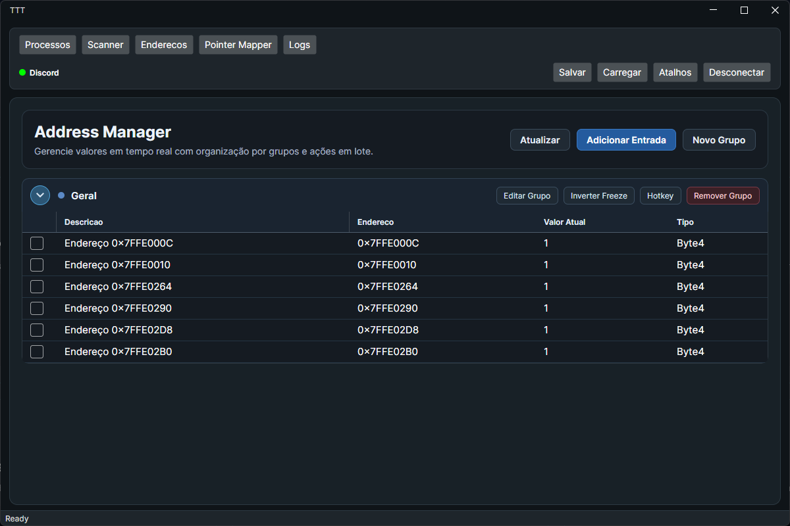
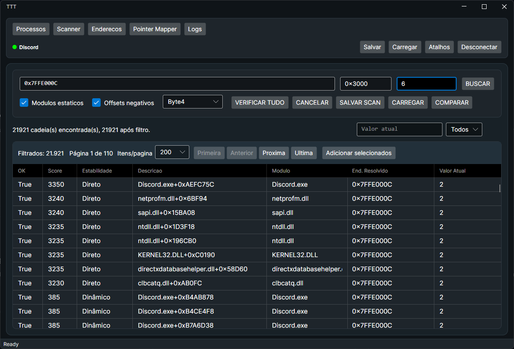
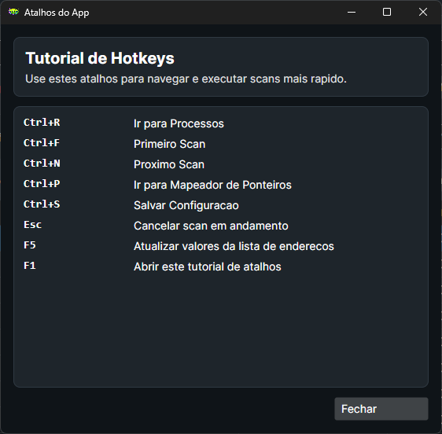
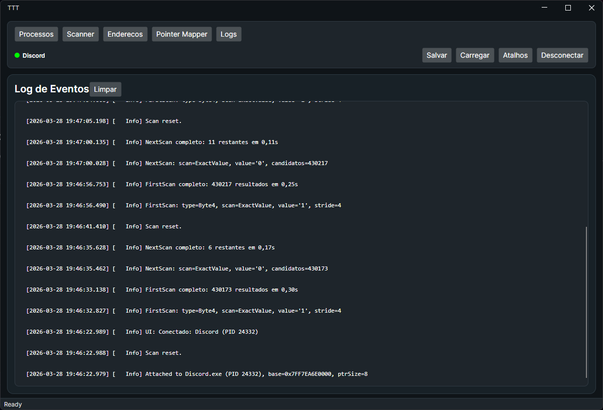

# TTT

> Real-time memory scanner and editor for Windows. Attach to any process, scan and filter values, freeze addresses, map pointer chains, and save sessions.



---

## Features

|                                                                   |                                                                                                                    |
| ----------------------------------------------------------------- | ------------------------------------------------------------------------------------------------------------------ |
|           |                                                                            |
| **Process Selector** — Filter and attach to any windowed process  | **Memory Scanner** — First Scan & Next Scan with exact, unknown, changed, unchanged, increased and decreased modes |
|                   |                                                                |
| **Address List** — Live value reading, freeze, groups and hotkeys | **Pointer Mapper** — Discover pointer chains for any target address                                                |
|                    |                                                                               |
| **Hotkeys** — Configurable global hotkeys per address group       | **Logs** — Centralized structured log panel                                                                        |

### Full feature list

- Attach and detach from local processes.
- Filter and list windowed processes.
- `First Scan` and `Next Scan`: exact value, unknown, changed, unchanged, increased and decreased.
- Address list with periodic live value reading.
- Edit values and freeze addresses in real time.
- Organize addresses into groups.
- Configure global hotkeys per group.
- Find pointer chains for a target address.
- Save and load session configuration.
- Auto-detect new versions published on GitHub Releases.
- Export auxiliary data to local files.
- Generate Windows installer with Inno Setup.

## Stack

- .NET 8 (`net8.0-windows`)
- Avalonia 11
- CommunityToolkit.Mvvm
- Windows APIs via P/Invoke (`ReadProcessMemory`, `WriteProcessMemory`, `VirtualQueryEx`, `VirtualProtectEx`)
- Inno Setup 6 for packaging

## Requirements

- Windows 10 or Windows 11
- x64 architecture
- .NET 8 SDK (for development)
- PowerShell 5.1+ (for the build script)
- Inno Setup 6 (to generate the installer)

> **Notes:**
>
> - The project is configured for `x64` only.
> - Some operations may require elevated privileges depending on the target process.
> - Protected processes or those with anti-cheat may fail to open a handle.

## Project Structure

```text
TTT.Migration.sln           Main solution
TTT/                        Desktop application
  Services/                 Business logic and memory access
  ViewModels/               MVVM orchestration
  Views/                    Avalonia screens
  Models/                   Data models
release.ps1                 Versioning, publishing, installer and GitHub Release
installer.iss               Inno Setup script
```

## Core Components

### Services

- `MemoryService` — opens the process, enumerates memory regions, reads/writes memory.
- `ScannerService` — runs parallel scans and refines results from previous scans.
- `PointerMapperService` — searches for pointer chains to a target address.
- `ConfigService` — saves/loads configuration and session state as JSON.
- `LogService` — centralizes application logs.

### ViewModels

- `MainViewModel` — navigation, lifecycle and configuration persistence.
- `ProcessViewModel` — process selection and attachment.
- `ScannerViewModel` — memory scanner and result pagination.
- `AddressListViewModel` — address list, freeze, groups and hotkeys.
- `PointerMapperViewModel` — pointer search, filtering and validation.
- `LogViewModel` — log display in the UI.

## Running in Development

From the repository root:

```powershell
dotnet restore .\TTT\TTT.csproj
dotnet build .\TTT\TTT.csproj -c Debug -p:Platform=x64
dotnet run --project .\TTT\TTT.csproj
```

## Publishing

To publish the app as a self-contained Windows x64 binary:

```powershell
dotnet publish .\TTT\TTT.csproj -c Release -f net8.0-windows -r win-x64 --self-contained true -p:Platform=x64
```

Output:

```text
TTT\bin\x64\Release\net8.0-windows\win-x64\publish
```

## Generating the Installer & Release

The full flow is handled by a single script: `release.ps1`.

Steps it performs:

1. Bumps the version in the `.csproj` and `installer.iss`.
2. Prepares the corresponding section in `CHANGELOG.md`.
3. Runs `dotnet build` in Release.
4. Runs `dotnet publish` self-contained for `win-x64`.
5. Compiles the installer with `ISCC.exe`.
6. Publishes a GitHub Release with the installer attached.

Example:

```powershell
.\release.ps1 -Version 2.0.1
```

To build everything without publishing to GitHub:

```powershell
.\release.ps1 -Version 2.0.1 -SkipGitHubRelease
```

Generated artifacts:

- Publish: `TTT\bin\x64\Release\net8.0-windows\win-x64\publish`
- Installer: `installer_output\TTT_Setup_<version>.exe`

## Auto-Update

The app automatically checks for the latest release on GitHub when the main window opens.

Flow:

1. Queries `releases/latest` from the GitHub API.
2. Compares the published tag with the version embedded in the executable.
3. When a newer version is found, shows a button in the top bar.
4. On confirmation, downloads the `.exe` installer from the release.
5. Runs silent installation and restarts the app.

> For this to work in production, the GitHub release must include the installer generated by `release.ps1`.

## Runtime Files

When running the app, auxiliary files may be created next to the executable:

| File/Folder        | Purpose                             |
| ------------------ | ----------------------------------- |
| `appsettings.json` | App state (e.g. last loaded config) |
| `logs.txt`         | Application log                     |
| `configs\`         | Saved session configurations        |
| `exports\`         | Exported files                      |
| `pointer-scans\`   | Pointer chain snapshots             |

## Usage Flow

1. Open the **Process** tab and attach to the target.
2. Go to the **Scanner** and run the first scan.
3. Refine results with `Next Scan`.
4. Send relevant addresses to the **Address List**.
5. Edit, freeze, or group entries.
6. Use the **Pointer Mapper** to locate persistent chains.
7. Save the configuration to reuse the session later.

## Limitations

- Windows-only — depends on native Windows APIs.
- The target process must be accessible to the current user or run with compatible permissions.
- Pointer chain stability depends on the memory layout of the analyzed process.
- Modifying memory of third-party processes may cause undefined behavior in the target.

## License

See [LICENSE](LICENSE).
